# Alerter - An Android Alerter Library, now in Kotlin!

This library aims to overcome the limitations of Toasts and Snackbars, while reducing the
complexity of your layouts.

[](https://android-arsenal.com/api?level=14) [](https://android-arsenal.com/details/1/5302) [](http://androidweekly.net/issues/issue-245)

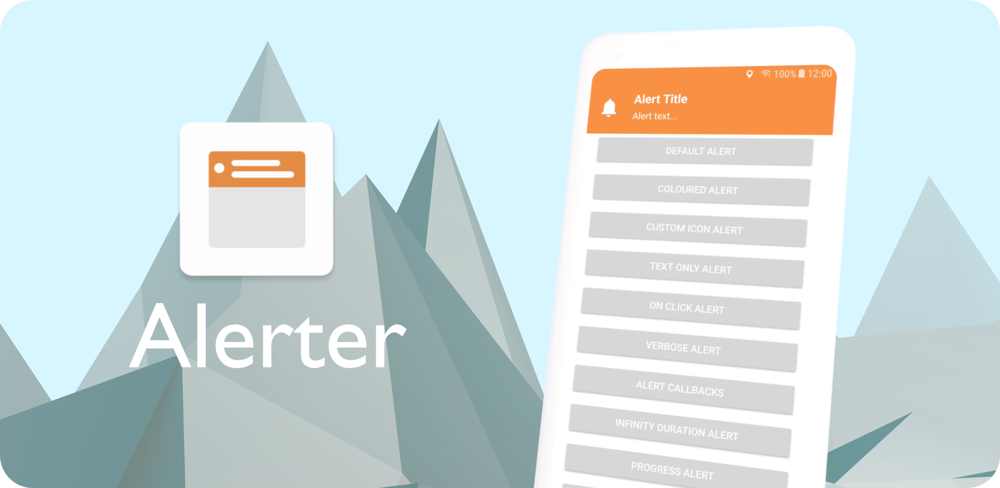

## General

With simplicity in mind, the Alerter employs the builder pattern to facilitate easy integration into any app.
A customisable Alert View is dynamically added to the Decor View of the Window, overlaying all content. 

## Install

Include the JitPack.io Maven repo in your project's build.gradle file

```groovy
allprojects {
 repositories {
    maven { url "https://jitpack.io" }
 }
}
```

Then add this dependency to your app's build.gradle file

```groovy
dependencies {
    implementation 'com.github.tapadoo:alerter:$current-version'
}
```

# Usage

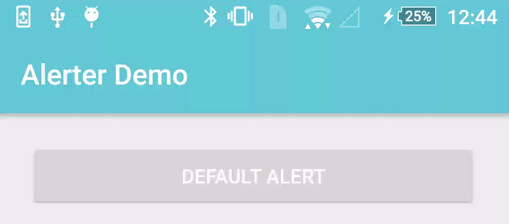

From an Activity -

```kotlin
Alerter.create(this@DemoActivity)
       .setTitle("Alert Title")
       .setText("Alert text...")
       .show()
```

Or from a Fragment -

```kotlin
Alerter.create(activity)
       .setTitle("Alert Title")
       .setText("Alert text...")
       .show()
```

To check if an alert is showing - 


```kotlin
Alerter.isShowing()
```

To hide a currently showing Alert - 

```kotlin
Alerter.hide()
```

# Customisation

### Background Colour

```kotlin
Alerter.create(this@DemoActivity)
       .setTitle("Alert Title")
       .setText("Alert text...")
       .setBackgroundColorRes(R.color.colorAccent) // or setBackgroundColorInt(Color.CYAN)
       .show()
```

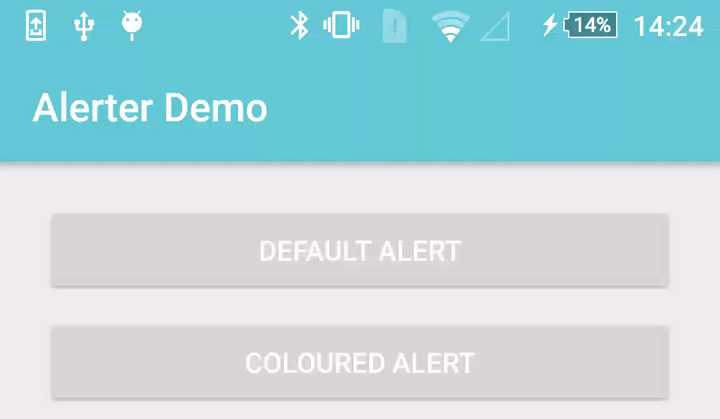

### Icon

```kotlin
Alerter.create(this@DemoActivity)
       .setText("Alert text...")
       .setIcon(R.drawable.alerter_ic_mail_outline)
       .setIconColorFilter(0) // Optional - Removes white tint
       .setIconSize(R.dimen.custom_icon_size) // Optional - default is 38dp
       .show()
```

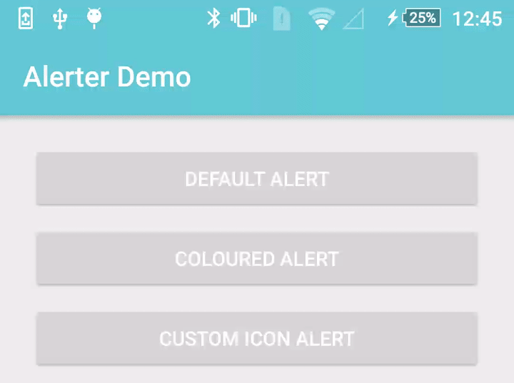

### On screen duration, in milliseconds

```kotlin
Alerter.create(this@DemoActivity)
       .setTitle("Alert Title")
       .setText("Alert text...")
       .setDuration(10000)
       .show()
```

### Without title

```kotlin
Alerter.create(this@DemoActivity)
       .setText("Alert text...")
       .show()
```

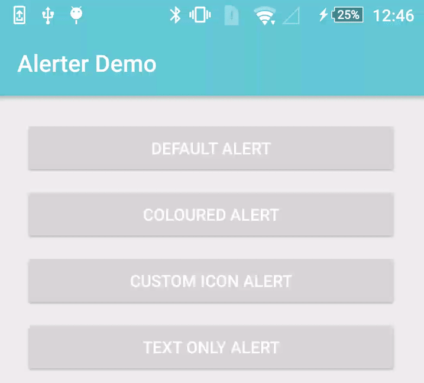

### Adding an On Click Listener

```kotlin
 Alerter.create(this@DemoActivity)
        .setTitle("Alert Title")
        .setText("Alert text...")
        .setDuration(10000)
        .setOnClickListener(View.OnClickListener {
            Toast.makeText(this@DemoActivity, "OnClick Called", Toast.LENGTH_LONG).show();
        })
        .show()
```

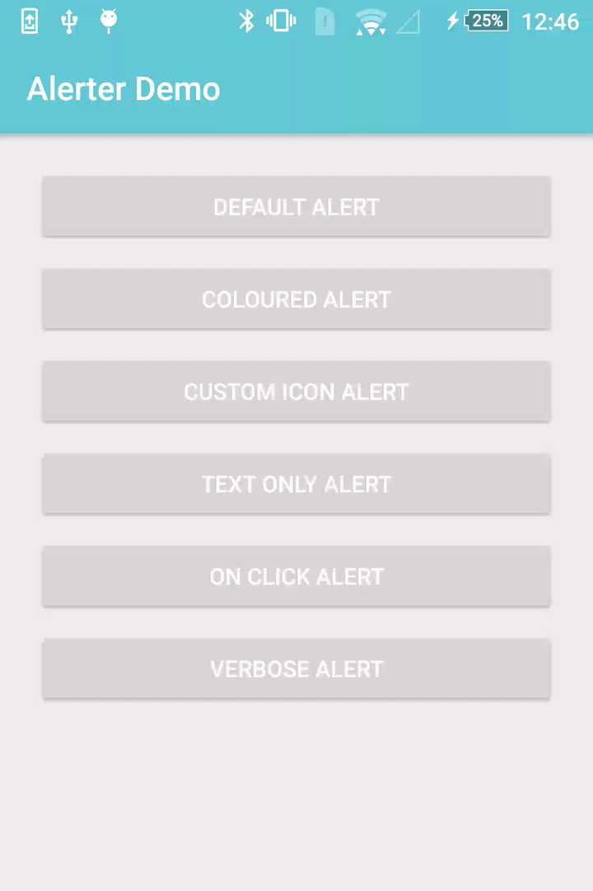

### Verbose text

```kotlin
 Alerter.create(this@DemoActivity)
        .setTitle("Alert Title")
        .setText("The alert scales to accommodate larger bodies of text. " +
                 "The alert scales to accommodate larger bodies of text. " +
                 "The alert scales to accommodate larger bodies of text.")
        .show()
```

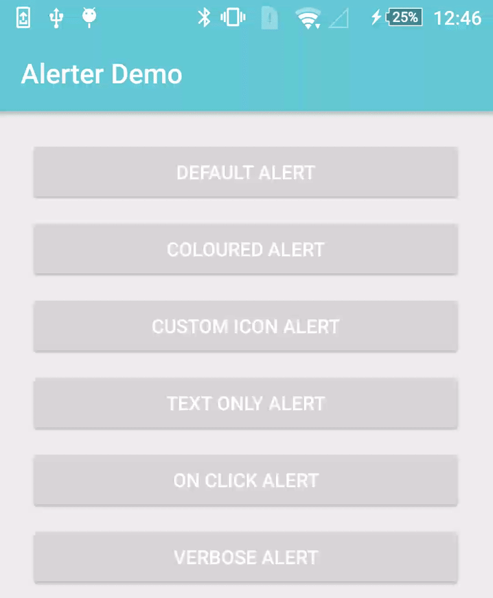

### Custom Enter/Exit Animations

```kotlin
  Alerter.create(this@KotlinDemoActivity)
         .setTitle("Alert Title")
         .setText("Alert text...")
         .setEnterAnimation(R.anim.alerter_slide_in_from_left)
         .setExitAnimation(R.anim.alerter_slide_out_to_right)
         .show()
```

### Visibility Callbacks

```kotlin
 Alerter.create(this@KotlinDemoActivity)
        .setTitle("Alert Title")
        .setText("Alert text...")
        .setDuration(10000)
        .setOnShowListener(OnShowAlertListener {
            Toast.makeText(this@KotlinDemoActivity, "Show Alert", Toast.LENGTH_LONG).show()
        })
        .setOnHideListener(OnHideAlertListener {
            Toast.makeText(this@KotlinDemoActivity, "Hide Alert", Toast.LENGTH_LONG).show()
        })
        .show()
```

### Custom Fonts and Text Appearance

```kotlin 
 Alerter.create(this@DemoActivity)
        .setTitle("Alert Title")
        .setTitleAppearance(R.style.AlertTextAppearance_Title)
        .setTitleTypeface(Typeface.createFromAsset(getAssets(), "Pacifico-Regular.ttf"))
        .setText("Alert text...")
        .setTextAppearance(R.style.AlertTextAppearance_Text)
        .setTextTypeface(Typeface.createFromAsset(getAssets(), "ScopeOne-Regular.ttf"))
        .show()
```

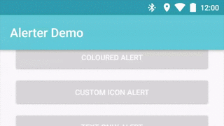

### Swipe to Dismiss

```kotlin
 Alerter.create(this@DemoActivity)
        .setTitle("Alert Title")
        .setText("Alert text...")
        .enableSwipeToDismiss()
        .show()
```
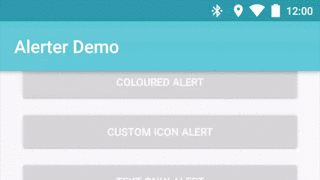

### Progress Bar

```kotlin
 Alerter.create(this@DemoActivity)
        .setTitle("Alert Title")
        .setText("Alert text...")
        .enableProgress(true)
        .setProgressColorRes(R.color.colorAccent)
        .show()
```

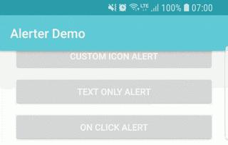

### With Buttons

```kotlin
 Alerter.create(this@KotlinDemoActivity)
        .setTitle(R.string.title_activity_example)
        .setText("Alert text...")
        .addButton("Okay", R.style.AlertButton, View.OnClickListener {
            Toast.makeText(this@KotlinDemoActivity, "Okay Clicked", Toast.LENGTH_LONG).show()
        })
        .addButton("No", R.style.AlertButton, View.OnClickListener {
            Toast.makeText(this@KotlinDemoActivity, "No Clicked", Toast.LENGTH_LONG).show()
        })
        .show()
```

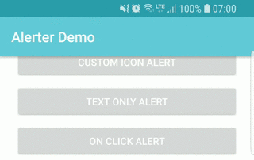

### With Custom Layout
```kotlin
 Alerter.create(this@KotlinDemoActivity, R.layout.custom_layout)
        .setBackgroundColorRes(R.color.colorAccent)
        .also { alerter ->
            val tvCustomView = alerter.getLayoutContainer()?.tvCustomLayout
            tvCustomView?.setText(R.string.with_custom_layout)
        }
        .show()
```

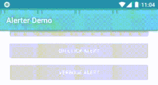

# Contributing & Reporting Issues

[Please read this if you're reporting an issue, or thinking of contributing!](./CONTRIBUTING.md)

## Licence

See the [LICENSE](LICENSE.md) file for license rights and limitations (MIT).

Copyright 2017 Tapadoo, Dublin.


